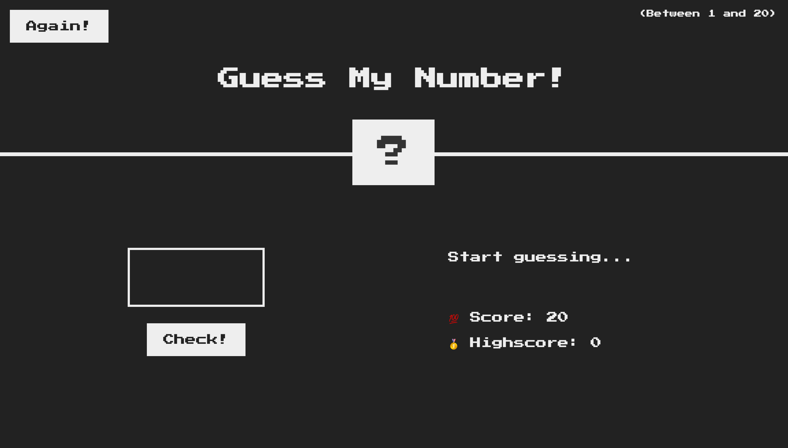
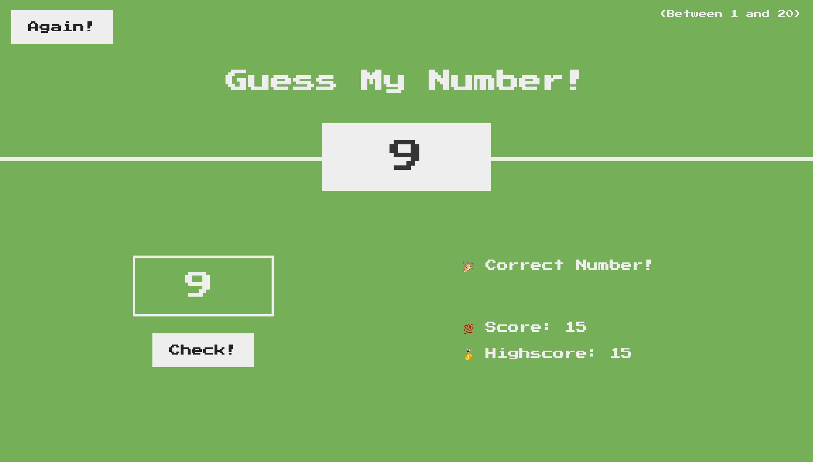

# Game Screen

This is the first step into my #50daysofCode Challenge where I am trying to go back to the basics to brush up on my skills.
Since this game is simple it inspired me to fashion it after a retro look.

Functionality

- There is a secret number that you have to guess.
- Every time you guess there is a prompt that tells you if you are too high or too low.
- If you run out of attempts before you guess - GAME OVER.
- If you guess before then then you win - background turns green.
- The fewer the attempts it takes the higher your "highscore".
- You can reset the game with the "again" button.
